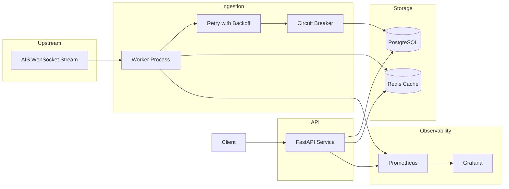

# feedstream Architecture

## System Overview

`feedstream` ingests live AIS maritime events, stores them durably, serves query APIs, and exposes operational telemetry for monitoring.

## Data Flow

1. Worker consumes AIS events from upstream WebSocket feed.
2. Worker normalizes event shape and computes `dedup_key`.
3. Worker writes to Postgres with idempotent insert semantics.
4. Worker invalidates relevant Redis cache keys after successful writes.
5. API queries Postgres and returns filtered, cursor-paginated responses.
6. API caches hot query responses in Redis with TTL.
7. Prometheus scrapes metrics from API and worker; Grafana visualizes trends.

## Component Notes

### 1. Upstream source (AIS stream)

- Purpose: external real-time event source.
- Typical failures: disconnects, throttling, malformed payloads.
- Observability: upstream connection status metrics and structured error logs.

### 2. Ingestion worker

- Purpose: resilient consumption, validation, dedup, and persistence.
- Typical failures: upstream drops, transient DB/network failures, backpressure.
- Observability: ingest counters, latency histograms, worker state gauge (`connected`, `retrying`, `disconnected`), retry/circuit-breaker event logs.

### 3. PostgreSQL

- Purpose: source of truth for events and time-range queries.
- Typical failures: connection exhaustion, slow queries, lock/contention issues.
- Observability: query latency histogram, connection pool metrics, retention-delete metrics.

### 4. Redis cache

- Purpose: reduce read latency and database pressure on hot endpoints.
- Typical failures: cache misses, unavailable Redis, stale keys.
- Observability: cache hit/miss counters, cache invalidation counters, fallback-to-DB logs.

### 5. API service (FastAPI)

- Purpose: serve query endpoints, docs, metrics, and debug stats.
- Typical failures: rate-limit abuse, invalid query params, dependency outages.
- Observability: request latency histogram by endpoint, status code counters, request ID correlation in all logs.

### 6. Observability stack (Prometheus + Grafana)

- Purpose: monitor health, performance, and incident diagnostics.
- Typical failures: scrape gaps, dashboard drift, missing labels.
- Observability: scrape success metrics and dashboard-level alerts (if configured).

## Reliability Patterns

- Idempotency: unique `dedup_key` prevents duplicate writes.
- Retry: exponential backoff with jitter for transient failures.
- Circuit breaker: pauses ingestion after repeated upstream faults.
- Graceful shutdown: worker flushes in-flight batch before exit.
- Retention: scheduled cleanup controls table growth.

## Security and Operations

- Secrets loaded from environment/platform secret store.
- Debug endpoints protected via token header.
- Rate limits on public API routes to reduce abuse.
- Structured logs with correlation IDs for traceability.

## Trade-offs

- Eventual freshness with caching TTL vs immediate consistency.
- Cursor pagination complexity vs stable performance at scale.
- Simpler single worker process vs distributed consumer group complexity.

## Related Docs

- ADRs: `docs/adr/`
- Deployment config: `fly.toml`
- Compose stack: `docker-compose.yml`
