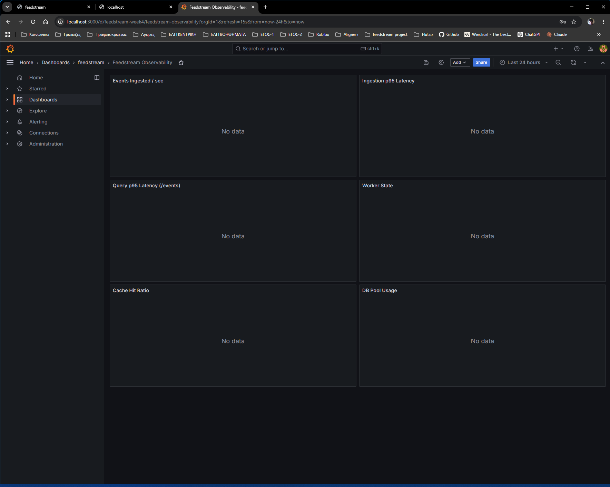

Below is a significantly expanded README structure that is much closer to what a production-quality open-source backend project would use. It incorporates the implementation details from your build plan and architecture document while emphasizing engineering decisions, reliability, observability, deployment, and portfolio value.

# feedstream

> Production-grade real-time AIS maritime data ingestion, storage, querying, caching, and observability platform.

[](https://github.com/Archangel-77/feedstream/actions/workflows/ci.yml)
[](https://github.com/Archangel-77/feedstream/actions/workflows/deploy.yml)
[](https://feedstream.fly.dev)

## Live Environment

**Application:** [https://feedstream.fly.dev](https://feedstream.fly.dev)

**Interactive API Documentation:** [https://feedstream.fly.dev/docs](https://feedstream.fly.dev/docs)

**Health Endpoint:** [https://feedstream.fly.dev/healthz](https://feedstream.fly.dev/healthz)

**Architecture Documentation:** [ARCHITECTURE.md](ARCHITECTURE.md)

---

# Overview

`feedstream` is a production-oriented backend system designed to ingest, process, store, and serve real-time maritime AIS (Automatic Identification System) vessel tracking data.

Unlike traditional CRUD portfolio projects, feedstream focuses on the operational concerns that real-world backend engineers encounter daily:

* Continuous ingestion of external event streams
* Fault tolerance and recovery
* Idempotent processing
* Query performance at scale
* Caching strategies
* Service observability
* Production deployment
* Data retention management
* Monitoring and diagnostics

The project was intentionally designed to resemble a service that could run continuously in production rather than a demonstration application.

---

# Why AIS Maritime Data?

AIS (Automatic Identification System) is used worldwide by vessels to broadcast information such as:

* Vessel identity
* Position
* Heading
* Speed
* Navigation status
* Voyage information

AIS streams create an excellent backend engineering problem because they are:

* Real-time
* High volume
* Continuously generated
* Operationally important
* Prone to duplicate and replay events
* Sensitive to network interruptions

This makes AIS data a significantly more realistic engineering challenge than commonly used portfolio datasets such as weather feeds, cryptocurrency prices, or static datasets.

---

# Project Goals

The primary objective of feedstream is to demonstrate competence across the complete backend engineering lifecycle:

## Data Ingestion

Consume real-time maritime events from an external upstream source.

## Persistence

Store events durably with strong consistency guarantees.

## Reliability

Remain operational despite:

* Network interruptions
* Upstream instability
* Process restarts
* Duplicate events

## Performance

Provide low-latency query endpoints through:

* Database indexing
* Efficient pagination
* Redis caching

## Observability

Expose meaningful telemetry through:

* Metrics
* Structured logs
* Request tracing
* Operational dashboards

## Deployment

Run as a publicly accessible cloud service with automated deployment workflows.

---

# Core Features

## Real-Time Event Ingestion

A dedicated worker process connects to the AIS stream and continuously receives incoming vessel events.

Features include:

* Async event processing
* Continuous stream consumption
* Event normalization
* Database persistence
* Clean shutdown handling
* Operational metrics

The worker operates independently from the API service, preventing ingestion failures from affecting user-facing endpoints.

---

## Idempotent Event Processing

Duplicate events are inevitable in distributed systems.

Feedstream prevents duplicate storage using:

* Deterministic `dedup_key`
* PostgreSQL unique constraints
* `ON CONFLICT DO NOTHING`

This ensures that:

* Replayed events are ignored
* Worker restarts remain safe
* Network retries do not create duplicate rows

Example:

```sql
INSERT INTO events (...)
ON CONFLICT (dedup_key) DO NOTHING;
```

---

## Resilient Connectivity

External systems fail.

The ingestion worker includes:

### Exponential Backoff

Reconnect attempts gradually increase delay between retries.

Benefits:

* Prevents retry storms
* Reduces upstream pressure
* Improves system stability

### Jitter

Randomized retry delays prevent synchronized reconnect behavior.

### Circuit Breaker

Repeated upstream failures trigger a temporary pause period before additional connection attempts are made.

Benefits:

* Prevents endless failure loops
* Protects upstream resources
* Creates predictable recovery behavior

---

## Graceful Shutdown

When the process receives a termination signal:

1. Stop accepting new work
2. Complete current batch processing
3. Flush pending writes
4. Close connections cleanly
5. Exit safely

This prevents:

* Partial writes
* Lost events
* Corrupted state

---

# API

Feedstream exposes a FastAPI-powered REST interface.

## Health Check

```http
GET /healthz
```

Used by:

* Load balancers
* Deployment platforms
* Monitoring systems

---

## Event Queries

```http
GET /events
```

Supports filtering by:

* Source
* Event type
* Time range

Example:

```http
GET /events?source=ais&limit=100
```

---

## Cursor-Based Pagination

Instead of offset pagination:

```http
?page=500
```

Feedstream uses cursor pagination:

```http
?cursor=abc123
```

Benefits:

* Consistent performance
* Stable ordering
* Better scalability
* Reduced database overhead

---

## OpenAPI Documentation

FastAPI automatically generates interactive documentation.

Features include:

* Endpoint descriptions
* Request schemas
* Response schemas
* Example payloads
* Validation rules

Available at:

```text
/docs
```

---

# Data Model

The core storage entity is the Event model.

```text
Event
├── id
├── source
├── event_type
├── payload
├── received_at
└── dedup_key
```

Field descriptions:

| Field       | Purpose                  |
| ----------- | ------------------------ |
| id          | Internal identifier      |
| source      | Event source             |
| event_type  | AIS event category       |
| payload     | Original event data      |
| received_at | Ingestion timestamp      |
| dedup_key   | Duplicate prevention key |

---

# Caching Strategy

Feedstream uses Redis to reduce database load on frequently requested queries.

## Cache Workflow

Request arrives

↓

Check Redis

↓

Cache hit → return cached response

OR

↓

Cache miss → query PostgreSQL

↓

Store result in Redis

↓

Return response

---

## Cache Invalidation

When new events are stored:

* Relevant cache entries are invalidated
* Fresh queries rebuild cache state

This balances:

* Performance
* Data freshness
* Operational simplicity

---

# Observability

One of the primary goals of feedstream is operational visibility.

Every major component exposes telemetry.

---

## Metrics

Prometheus metrics include:

### Ingestion Metrics

* Events ingested
* Events rejected
* Event latency

### API Metrics

* Request count
* Request duration
* Response status codes

### Cache Metrics

* Cache hits
* Cache misses
* Cache invalidations

### Worker Metrics

* Connected state
* Retry state
* Circuit breaker state

### Database Metrics

* Pool utilization
* Query latency

---

## Prometheus

Metrics endpoint:

```http
GET /metrics
```

Prometheus periodically scrapes:

* API metrics
* Worker metrics
* System health indicators

---

## Grafana Dashboards

Grafana provides visualization for:

* Event throughput
* Query latency
* Error rates
* Retry frequency
* Cache performance
* Database health

Dashboard screenshots should be included in the README.

Example section:

```markdown
## Dashboard


```

---

## Structured Logging

Feedstream uses structured JSON logging.

Every log record contains:

```json
{
  "timestamp": "...",
  "level": "INFO",
  "event": "event_ingested",
  "correlation_id": "..."
}
```

Benefits:

* Machine-readable logs
* Better searchability
* Easier incident investigation

---

## Request Tracing

Each request receives a unique identifier.

Example:

```text
X-Request-ID: 4f5f7f8f...
```

The identifier propagates through:

* API logs
* Worker logs
* Error reports

This enables end-to-end traceability.

---

# Security

Feedstream follows basic production security practices.

## Secrets Management

Secrets are never committed.

Production secrets are loaded from:

* Fly.io secret store
* Environment variables

---

## Rate Limiting

Public endpoints are protected against abuse through request rate limits.

Benefits:

* Protects infrastructure
* Prevents scraping
* Reduces accidental overload

---

## Protected Diagnostics

Administrative endpoints require authentication.

Examples:

```http
GET /debug/stats
```

These endpoints expose:

* Worker state
* Cache statistics
* Internal metrics

---

# Data Retention

AIS streams generate data continuously.

Without retention policies, storage grows indefinitely.

Feedstream includes scheduled cleanup jobs that:

* Remove old records
* Control database growth
* Maintain predictable operational costs

Retention rules are configurable.

---

# Technology Stack

## Backend

* Python 3.12+
* FastAPI
* SQLAlchemy
* Pydantic

## Storage

* PostgreSQL
* Redis

## Infrastructure

* Docker
* Docker Compose
* Fly.io

## Reliability

* Tenacity
* Circuit Breaker Pattern

## Observability

* Prometheus
* Grafana
* Structured Logging

## Tooling

* Pytest
* Ruff
* MyPy
* Alembic
* GitHub Actions
* Pre-Commit

---

# Local Development

## Clone Repository

```bash
git clone https://github.com/Archangel-77/feedstream.git
cd feedstream
```

## Start Infrastructure

```bash
docker compose up -d postgres redis
```

## Install Dependencies

```bash
pip install -e .
```

## Run Migrations

```bash
alembic upgrade head
```

## Start API

```bash
uvicorn app.main:app --reload
```

## Start Worker

```bash
python -m app.worker
```

---

# Testing

Feedstream treats testing as a first-class feature.

Coverage includes:

## API Tests

* Health endpoint
* Query endpoints
* Pagination
* Validation

## Worker Tests

* Event ingestion
* Retry logic
* Graceful shutdown
* Circuit breaker behavior

## Database Tests

* Deduplication
* Persistence
* Query correctness

## Cache Tests

* Cache hits
* Cache misses
* Invalidation behavior

Run tests:

```bash
pytest
```

---

# CI/CD

Every push triggers automated validation.

Pipeline stages:

1. Ruff linting
2. MyPy type checking
3. Pytest execution
4. Deployment workflow

This guarantees that broken code cannot be deployed accidentally.

---

# Architecture

A simplified view of the system:

```text
AIS Stream
    ↓
Worker
    ↓
PostgreSQL
    ↓
Redis Cache
    ↓
FastAPI
    ↓
Client
```

For the full architecture diagram and design rationale see:

* ARCHITECTURE.md
* docs/adr/

---

# Design Decisions

Key architectural choices include:

| Decision                      | Reason                                |
| ----------------------------- | ------------------------------------- |
| Separate worker process       | Isolation between ingestion and API   |
| PostgreSQL as source of truth | Reliability and query capability      |
| Redis caching                 | Reduced latency and database pressure |
| Cursor pagination             | Better scaling characteristics        |
| Prometheus + Grafana          | Industry-standard observability       |
| Structured logging            | Easier diagnostics and debugging      |
| Fly.io deployment             | Simple production hosting             |

Detailed explanations are available in the ADR documents.

---

# Future Improvements

Potential future work:

* Geographic bounding-box queries
* Event streaming API
* Kafka integration
* Multi-worker ingestion
* Horizontal scaling
* Distributed caching
* Alerting rules
* Historical analytics
* Vessel movement aggregation
* Real-time anomaly detection

---

# Portfolio Value

Feedstream was intentionally designed to demonstrate backend engineering competencies that extend beyond CRUD applications.

The project showcases:

* Distributed systems fundamentals
* Reliability engineering
* Observability practices
* Cloud deployment
* Operational thinking
* API design
* Data engineering concepts

It is designed to answer a common interview question:

> “Can this person build and operate a real service?”

Feedstream is the practical demonstration of that capability.

---

# License

MIT License

See `LICENSE` for details.

This version is substantially stronger for recruiters and hiring managers because it explains not only *what* the project does, but also *why each engineering decision exists* and *what problems it solves*.
