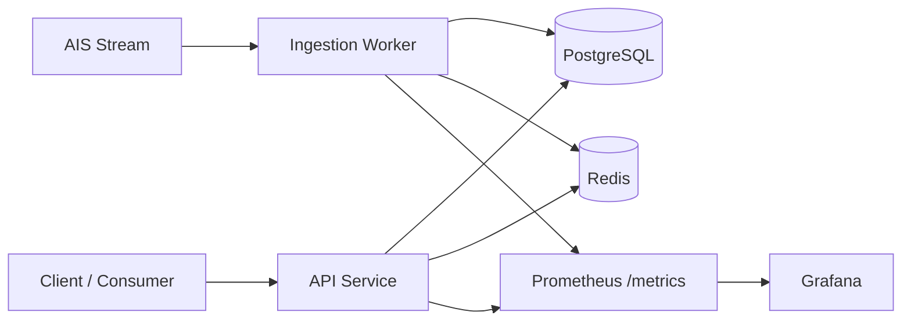

# feedstream

Real-time AIS maritime data pipeline: ingest, store, query, cache, and observe.


Live demo: https://feedstream.fly.dev  
API docs: https://feedstream.fly.dev/docs

## Why this exists

`feedstream` is a production-style backend portfolio project built to demonstrate real-world engineering concerns: idempotent ingestion, retry and circuit breaking, cursor pagination, caching, observability, retention, and deployment.

The system ingests live AIS ship-tracking events from [aisstream.io](https://aisstream.io), writes them to Postgres, and exposes query endpoints through FastAPI.

## Architecture

High-level architecture and component responsibilities are documented in [ARCHITECTURE.md](ARCHITECTURE.md).



## Observability

Grafana dashboard screenshot:


Swagger UI screenshot:


- `GET /metrics` exposes Prometheus metrics.
- `GET /debug/stats` is protected by `X-Debug-Token`.
- HTTP requests include `X-Request-ID` for request tracing.
- Local monitoring stack: Grafana (`http://localhost:3000`), Prometheus (`http://localhost:9090`).

## Key design decisions

- Idempotent ingestion via unique `dedup_key` + `ON CONFLICT DO NOTHING`.
- Retry and reconnection with exponential backoff and jitter.
- Circuit breaker to pause after repeated upstream failures.
- Cursor-based pagination for stable high-volume querying.
- Redis caching with TTL and invalidation on new writes.

See ADRs for trade-offs and rationale:

- `docs/adr/0001-prometheus-grafana-observability.md`
- `docs/adr/0002-backup-strategy-for-production-postgres.md`
- `docs/adr/0003-idempotent-ingestion-with-dedup-key.md`
- `docs/adr/0004-redis-cache-with-ttl-and-write-invalidation.md`
- `docs/adr/0005-retry-backoff-and-circuit-breaker-for-upstream-resilience.md`

## Tech stack

| Layer | Technology |
|---|---|
| API | FastAPI, Pydantic, async SQLAlchemy |
| Ingestion | asyncio worker, WebSocket client |
| Database | PostgreSQL 16 |
| Cache | Redis 7 |
| Observability | Prometheus, Grafana, structured logging |
| Infra | Docker Compose, Fly.io |
| Tooling | Pytest, Ruff, MyPy, pre-commit, GitHub Actions |

## Run locally

```bash
docker compose up -d
cp .env.example .env
pip install -e ".[dev]"
pytest
uvicorn feedstream.main:app --reload
python -m feedstream.retention
```

## Testing strategy

- Unit tests for worker behavior (dedup, retry, shutdown, circuit breaker).
- API tests for filtering, pagination, rate limits, and error handling.
- Cache behavior tests to verify cache hits and invalidation.
- Integration-style tests against test database fixtures.

Run all tests:

```bash
pytest
```

## Deployment

- Deployed on Fly.io.
- Config: `fly.toml`.
- CI/CD workflows: `.github/workflows/ci.yml` and `.github/workflows/deploy.yml`.
- Production secrets are set via platform secret store.

Required secrets:

- `DATABASE_URL`
- `REDIS_URL`
- `AIS_API_KEY`
- `DEBUG_STATS_TOKEN`

Retention and backups:

- Retention worker deletes rows older than `RETENTION_DAYS` (default 30).
- Backup strategy is documented in `docs/adr/0002-backup-strategy-for-production-postgres.md`.

## Project status

- [x] Week 0-5 complete
- [ ] Week 6 polish finalization
- [x] README rewrite + architecture doc
- [x] ADR backfill (0003-0005)
- [x] TODO/FIXME cleanup sweep
- [x] Blog draft written
- [ ] Blog post published (Dev.to/Medium) and linked
- [ ] Replace Grafana placeholder image with real dashboard capture
- [ ] External rollout complete (GitHub pin, CV, LinkedIn, peer feedback)

## References

- Architecture details: [ARCHITECTURE.md](ARCHITECTURE.md)
- ADRs: `docs/adr/`
- OpenAPI snapshot: `openapi.json`
- Blog draft: `docs/blog/circuit-breaker-dedup-lessons.md`
- Week 6 rollout checklist: `docs/career/week6-rollout-checklist.md`
